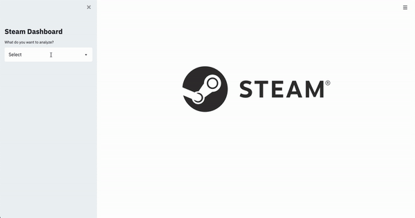
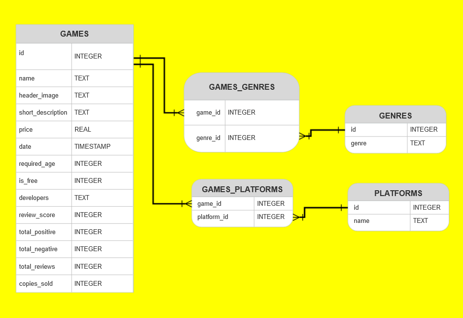
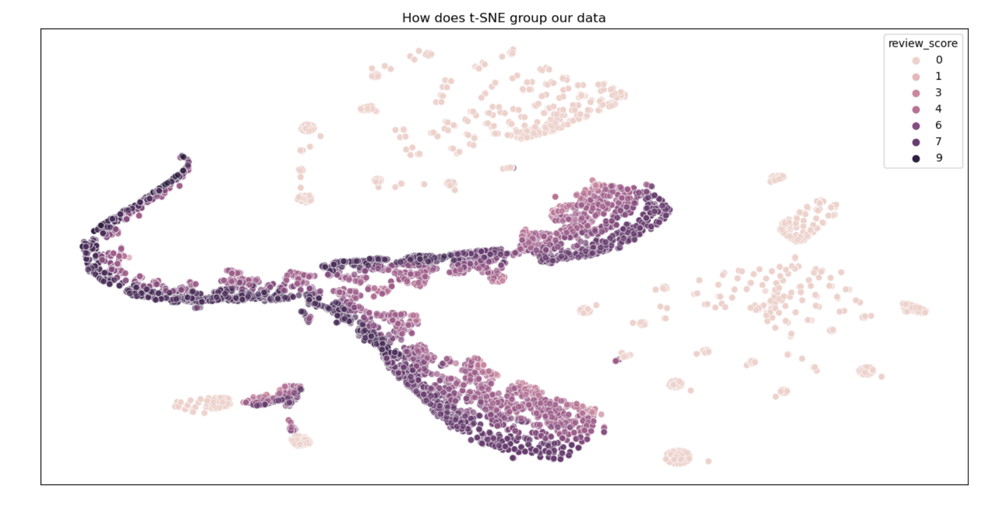

# Deployment challenge - Steam analytics

# Description
This was a project during our time at BeCode.  
Our coach provided us a .JSON file, with information scraped from the website of <a href="https://store.steampowered.com/" target="_blank">steam</a>.  
The file contained webshop data on 3000+ games.  

# Goal
1. Extract useful information from .JSON
2. Build a relational database using SQL
3. Make visualizations on the data
4. Build a website with nice visuals.

# Installation
### Python version
* Python 3.9

### Packages used
* pandas==1.3.1
* seaborn==0.11.1
* plotly==5.2.2
* matplotlib==3.4.2
* streamlit==0.87.0

### Webservice
* <a href="https://www.heroku.com" target="_blank">Heroku</a>

### Making container images
* <a href="https://www.docker.com/" target="_blank">Docker</a>

### Our Docker image
We pushed our [Docker image](https://hub.docker.com/r/maartenvdbulcke/steam-final) to Docker Hub

# Usage
### Main folder
| Folder            | Description                                                 |
|-------------------|-------------------------------------------------------------|
| data_json         | Directory containing the original .json file on steam data. |
| old_versions      | Directory containing all files for early versions. * version 1 * version 2 * version 3 |
| images            | Directory containing images used for readme.md              |
| final_version | Directory containing all files for final version            |

### final_version
| File                  | Description                                                |
|-----------------------|------------------------------------------------------------|
| data_files            | Directory containing all our .csv files.                   |
| database              | Database created using info from the .csv files.           |
| utils                 | Directory containing Python files:                         |
| ** create_database.py | Code used to create the database                           |
| ** json_to_df.py      | Code used to convert the .json file to a Pandas dataframe. |
| app.py                | Code used for deployment on a website                      |

# Project evolution
| Version #     | Website                                               |
|---------------|-------------------------------------------------------|
| Version 1     | https://deploy-island.herokuapp.com/                  |
| Version 2     | https://steam-deployment-project.herokuapp.com        |
| Version 3     | https://steaming-on.herokuapp.com/                    |
| Final version | https://steam-deployment-project-final.herokuapp.com/ |

# Sample of our app

# ERD of our SQLITE-database 

# t-SNE plot of our data 

# Contributors
| Name                   | Github                              |
|------------------------|-------------------------------------|
| Matthew Samyn          | https://github.com/matthew-samyn    |
| Logan Vendrix          | https://github.com/lvendrix         |
| Maarten Van den Bulcke | https://github.com/MaartenVdBulcke  |
| Amaury van Kesteren    | https://github.com/AmauryvanKeste   |

# Timeline
26/08/2021 - 01/09/2021
